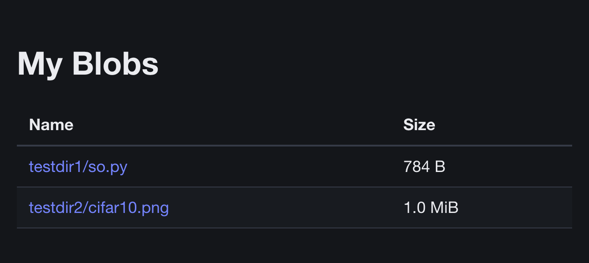

# BlobBrowser

A lightweight web server to list the contents of an Azure blob container with download links.
The server reads the container contents on startup so will need to be restarted for changes to the container to be reflected.

**Note** By design, this is insecure.
The downloads page is protected only by a single hashed string, which is sent in the GET request query parameters.
Do not give this web server access to anything that should be kept private.

## Running Locally

1. Obtain the code and `cd blobbrowser/`.
1. Build the binary with `go build`.
1. Set [environment variables](#environment-variables).
1. Make sure you have sufficient [permissions](#permissions).
1. Run with `./browser`.
1. Open a web browser and go to `localhost:80`.

## Running on Azure

1. If you don't have a container registry already, create one.
   You can create an Azure Container Registry with `az acr create`.
1. Login to it with `az acr login --name myregistry`.
   See [Push and Pull docs](https://learn.microsoft.com/en-us/azure/container-registry/container-registry-get-started-docker-cli?tabs=azure-cli).
1. Build an image with `docker build`.
   If using an Azure ACR, the command will be something like `docker build --platform="linux/amd64" --tag "myregistry.azurecr.io/images/blobbrowser" .`.
1. Push the image with `docker push`.
1. Set up an Azure App Service that runs the pushed image.
1. Set [environment variables](#environment-variables).
1. Give the app service a system-managed identity and give that identity sufficient [permissions](#permissions).

## Development

1. Install pre-commit hooks with `pre-commit install --install-hooks`.
1. Limit line length with `golines -w *.go`.
1. Format with `go fmt -w *.go`.
1. Run tests with `go test -coverprofile cover.out`.
1. View test coverage with `go tool cover -html=cover.out`.

## Environment Variables

- *Optional* `USE_DEFAULT_CREDENTIAL="true"` will try several Azure authentication methods, such as CLI, VSCode and managed identity.
  Not setting this or setting it to any other value will use managed identity authentication.
  You will need to use this option when running locally.
- *Optional* `BLOBBROWSER_TITLE="Your Page Title Here"` to customise the page title and heading.
- *Mandatory* `AZURE_STORAGE_ACCOUNT_NAME="mystorageaccount"` will set the name of the Azure storage account.
- *Mandatory* `AZURE_CONTAINER_NAME="mytestcontainer"` will set the name of the Azure storage account container.
- *Mandatory* `BLOBBROWSER_SECRET="cYdPWwBiUPm9pEcYdPWwBiUPm9pE"` is a password, which must be hashed with bcrypt (e.g [here](https://bcrypt.online/)).
  It will be used by users to access the `/list` page.

## Permissions

Whoever the server is running as (typically either you or a managed identity) will need to have sufficient permissions to list the contents of the blob container and to delegate access.

One way to get enough permissions is to assign the "Storage Blob Delegator" and "Storage Blob Data Reader" roles.
